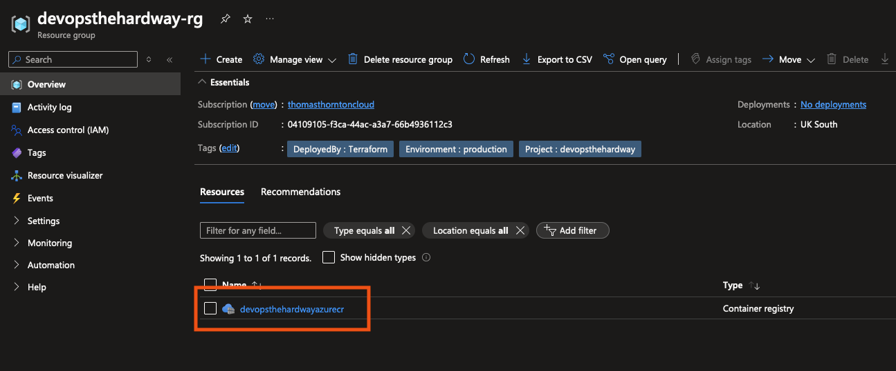

# Create an Azure Container Registry Repository

## 🎯 **Tutorial Overview**
**Estimated Time:** ⏱️ **15-20 minutes**  
**Prerequisites Level:** Basic Azure and Terraform knowledge

In this lab, you'll create a repository in Azure Container Registry (ACR) to store the Docker image for the thomasthornton.cloud app.

### 📋 **Learning Objectives**
By the end of this tutorial, you will:
- [ ] Understand Azure Container Registry fundamentals
- [ ] Create ACR infrastructure using Terraform
- [ ] Configure Terraform backend for state management
- [ ] Apply Azure resource tagging best practices
- [ ] Validate ACR deployment and functionality

### ⚠️ **Important Notes**
- Ensure your ACR name is globally unique (Azure requirement)
- Standard SKU provides good balance of features and cost
- Backend state storage must be configured before running Terraform

## 🛠️ Create the ACR Terraform Configuration

### ✅ **Prerequisites Checklist**
Before starting, ensure you have:
- [ ] Terraform installed (version 1.9.8 or later)
- [ ] Azure CLI installed and configured (`az login` completed)
- [ ] Storage account for Terraform state already created (from 1-Azure section)
- [ ] Basic understanding of Terraform and ACR concepts
- [ ] Text editor or IDE for configuration files

### 📚 **Background Knowledge**
**What is Azure Container Registry?**
- Private Docker registry service in Azure
- Stores and manages container images
- Integrates with Azure Kubernetes Service (AKS)
- Provides security scanning and access control

## 🚀 **Step-by-Step Implementation**

### **Step 1: Review and Customize Configuration** ⏱️ *5 minutes*
1. **📝 Update Terraform Variables**
   - Open the [terraform.tfvars](https://github.com/thomast1906/DevOps-The-Hard-Way-Azure/tree/main/2-Terraform-AZURE-Services-Creation/1-acr/terraform.tfvars) file
   - Ensure all values are accurate for your environment and **globally unique**
   
   ```hcl
   # Example customization
   name     = "mycompanyacr2024"  # Must be globally unique!
   location = "uksouth"           # Change if desired
   ```

   **✅ Validation:** Check that your ACR name is unique by running:
   ```bash
   az acr check-name --name "your-acr-name"
   ```

### **Step 2: Understand the Infrastructure** ⏱️ *5 minutes*
2. **🔍 Review Terraform Configuration**
   
   **📚 What this configuration creates:**
   - [ ] **Resource Group** - Container for all ACR resources
   - [ ] **Container Registry** - Private Docker image repository
   - [ ] **Terraform Backend** - Remote state storage in Azure
   - [ ] **Resource Tags** - Metadata for organization and cost tracking
   
   **🎯 Key Features:**
   - **SKU:** Standard (good balance of features and cost)
   - **Admin Access:** Enabled for development scenarios
   - **Location:** UK South (configurable)
   - **Retention:** Configured for compliance

   Review the [ACR Terraform configuration](https://github.com/thomast1906/DevOps-The-Hard-Way-Azure/tree/main/2-Terraform-AZURE-Services-Creation/1-acr) to understand:
   - [ ] Resource definitions and relationships
   - [ ] Output values for use in other modules
   - [ ] Variable usage and defaults

### **Step 3: Deploy the Infrastructure** ⏱️ *10 minutes*
3. **🏗️ Create the ACR**
   
   **📂 Navigate to the configuration directory:**
   ```bash
   cd 2-Terraform-AZURE-Services-Creation/1-acr
   ```

   **🔧 Initialize Terraform:**
   ```bash
   terraform init
   ```
   **✅ Expected Result:** Terraform downloads providers and configures backend

   **📋 Plan the deployment:**
   ```bash
   terraform plan
   ```
   **✅ Expected Result:** Shows resources to be created (should show ~2-3 resources)

   **🚀 Apply the configuration:**
   ```bash
   terraform apply
   ```
   **✅ Expected Result:** ACR and resource group created successfully

## ✅ **Validation & Testing**

### **Step 4: Verify Deployment** ⏱️ *5 minutes*
**🔍 Validate your ACR deployment:**

1. **Azure Portal Verification:**
   - [ ] Log into the [Azure Portal](https://portal.azure.com)
   - [ ] Navigate to [Container Registries](https://portal.azure.com/#browse/Microsoft.ContainerRegistry%2Fregistries)
   - [ ] Locate your newly created ACR
   - [ ] Verify the following properties:
     - **Status:** Available
     - **SKU:** Standard
     - **Location:** Matches your configuration
     - **Admin user:** Enabled

2. **Azure CLI Verification:**
   ```bash
   # Check ACR exists and is accessible
   az acr list --query "[?name=='your-acr-name']" --output table
   
   # Verify login capability
   az acr login --name your-acr-name
   ```
   **✅ Expected Result:** Login successful message

3. **Terraform State Verification:**
   ```bash
   # View created resources
   terraform show
   
   # Check outputs
   terraform output
   ```

**📸 Expected Result:**


### **� Functionality Test**
**Test ACR basic functionality:**
```bash
# Pull a test image and push to your ACR
docker pull hello-world
docker tag hello-world your-acr-name.azurecr.io/hello-world:test
docker push your-acr-name.azurecr.io/hello-world:test
```

## 🚨 **Troubleshooting Guide**

### **Common Issues & Solutions**

| ❌ **Problem** | 🔧 **Solution** |
|----------------|-----------------|
| ACR name already exists | Choose a globally unique name (try adding numbers/date) |
| Authentication failed | Run `az login` and verify subscription access |
| Terraform backend error | Ensure storage account exists and you have access |
| Permission denied | Verify Azure CLI is logged in with correct permissions |
| Plan shows no changes | Check if resources already exist or variables are correct |

### **🆘 Detailed Troubleshooting**

**Issue: "ACR name not available"**
```bash
# Check name availability
az acr check-name --name "your-proposed-name"

# Generate unique name
echo "mycompanyacr$(date +%Y%m%d)"
```

**Issue: "Backend initialization failed"**
```bash
# Verify storage account exists
az storage account show --name "your-storage-account" --resource-group "your-rg"

# Check access keys
az storage account keys list --account-name "your-storage-account"
```

## 🎓 **Knowledge Check Questions**

Test your understanding:

- [ ] **Question 1:** Why is it beneficial to use Terraform for creating cloud resources like ACR?
  <details>
  <summary>💡 Answer</summary>
  Infrastructure as Code provides version control, repeatability, and team collaboration. Changes are tracked, and infrastructure can be recreated consistently.
  </details>

- [ ] **Question 2:** How does storing Terraform state in Azure Storage help in team environments?
  <details>
  <summary>💡 Answer</summary>
  Remote state allows multiple team members to work on the same infrastructure, provides state locking to prevent conflicts, and ensures state persistence.
  </details>

- [ ] **Question 3:** What are the advantages of using ACR over public registries?
  <details>
  <summary>💡 Answer</summary>
  Private access control, integration with Azure services, geo-replication, vulnerability scanning, and compliance with corporate policies.
  </details>

## 🎯 **Achievement Unlocked!**
🏆 **Container Registry Master** - You've successfully created your first Azure Container Registry using Infrastructure as Code!

### **What You've Accomplished:**
- [x] Created ACR infrastructure with Terraform
- [x] Configured remote state management
- [x] Applied Azure resource tagging
- [x] Validated deployment functionality
- [x] Gained troubleshooting skills

### **Next Steps:**
- [ ] Proceed to [Create VNET](./2-Create-VNET.md)
- [ ] Learn about [Docker image creation](../3-Docker/1-Create-Docker-Image.md)

## 💡 **Pro Tips & Best Practices**
Consider implementing these additional security and operational best practices for your ACR:

1. **Enhanced Security**:
   - Enable content trust for image signing: `admin_enabled = false` (already set)
   - Configure private link endpoints to restrict network access
   - Use Managed Identity for authentication instead of admin credentials

2. **Cost Optimisation**:
   - Monitor image usage and implement retention policies
   - Use Premium SKU only if you need geo-replication or other advanced features
