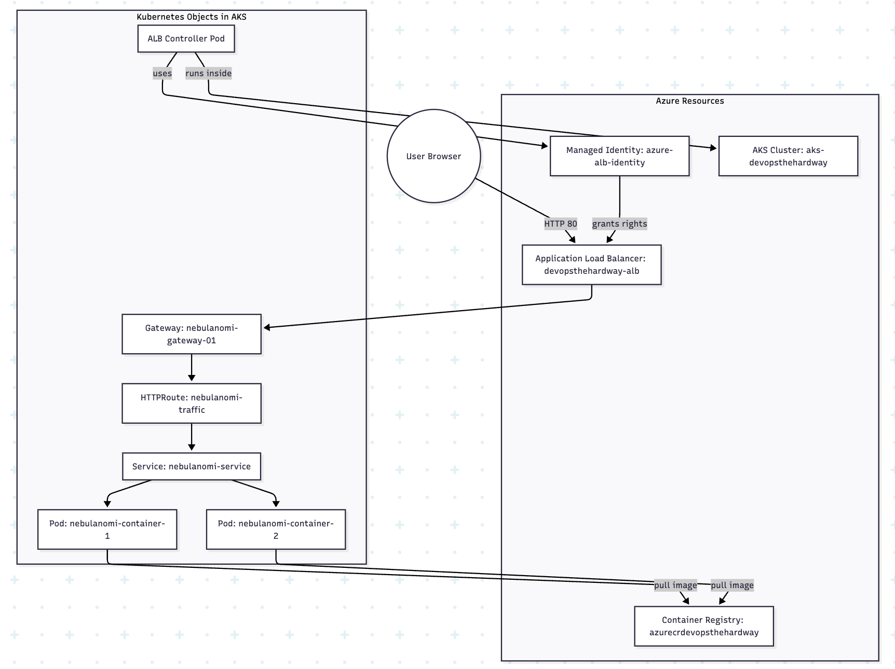

# Kubernetes Manifests for AKS Deployment

## Overview
This directory contains the Kubernetes manifest files and instructions needed to deploy the thomasthornton.cloud application to Azure Kubernetes Service (AKS). These manifests define how the application will run in the AKS cluster.

## Contents

- [Connecting to AKS](./1-Connect-To-AKS.md) - Learn how to connect to your AKS cluster
- [Creating Kubernetes Manifests](./2-Create-Kubernetes-Manifest.md) - Learn about the manifest files for deployment
- [Deploying the Application](./3-Deploy-Thomasthorntoncloud-App.md) - Deploy the application to your AKS cluster

## Directory Structure

```
.
├── deployment.yml                     # Kubernetes deployment manifest for the application
├── images/                            # Screenshots and documentation images
└── scripts/                           # Helper scripts
    ├── 1-alb-controller-install-k8s.sh      # Script to install Azure Load Balancer controller
    └── 2-gateway-api-resources.sh           # Script to create Gateway API resources
```

## Deployment Process

The deployment process follows these key steps:

1. Connect to your AKS cluster using `kubectl`
2. Understand the Kubernetes manifest structure
3. Deploy the application using `kubectl apply`
4. Verify the deployment and access the application

## Features

The Kubernetes deployment in this section includes:

- Deployment resource to manage pod replicas
- Service resource to expose the application
- Integration with Azure Load Balancer
- Configuration for scaling and high availability

## Next Steps

After completing the deployment:

1. Review the [Terraform Static Code Analysis](../5-Terraform-Static-Code-Analysis/1-Checkov-For-Terraform.md) section to learn about security scanning
2. Consider implementing monitoring and observability solutions for your AKS deployment

## Best Practices

The Kubernetes manifests in this section follow these best practices:

1. Resource requests and limits
2. Liveness and readiness probes
3. Proper labeling for resources
4. Security context configurations
5. Network policies (to be added)

## Diagram of how it works
